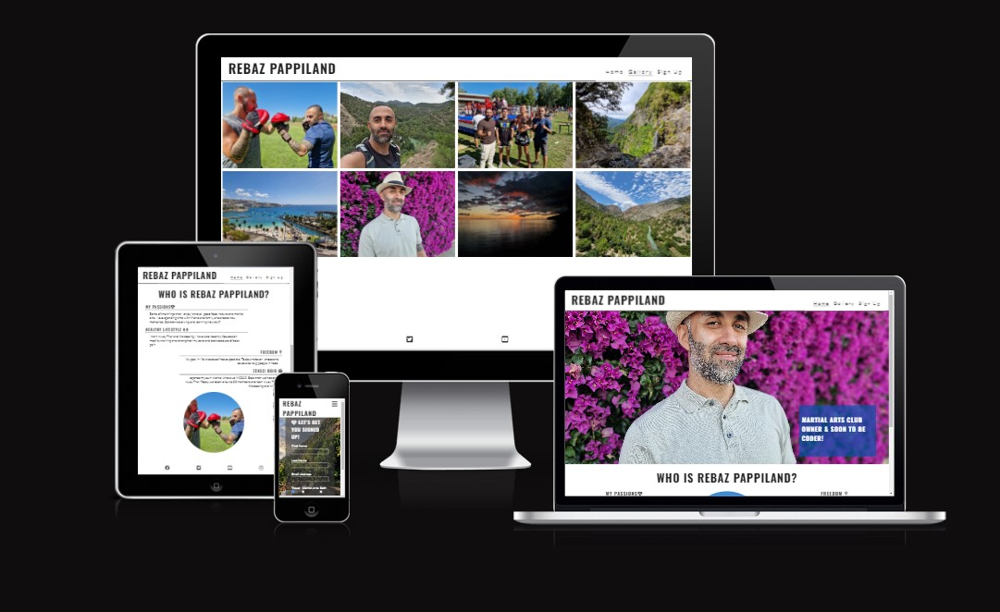
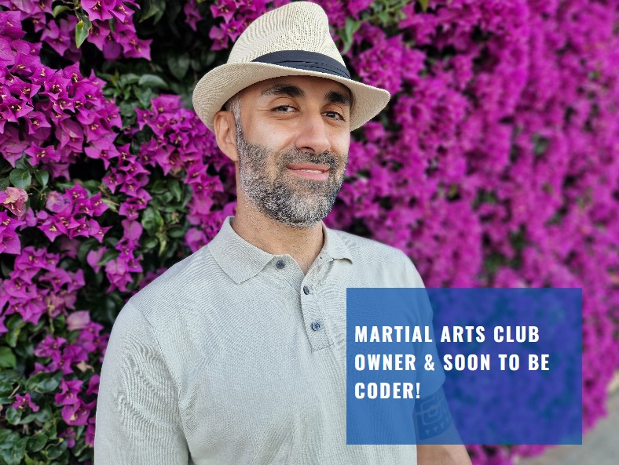
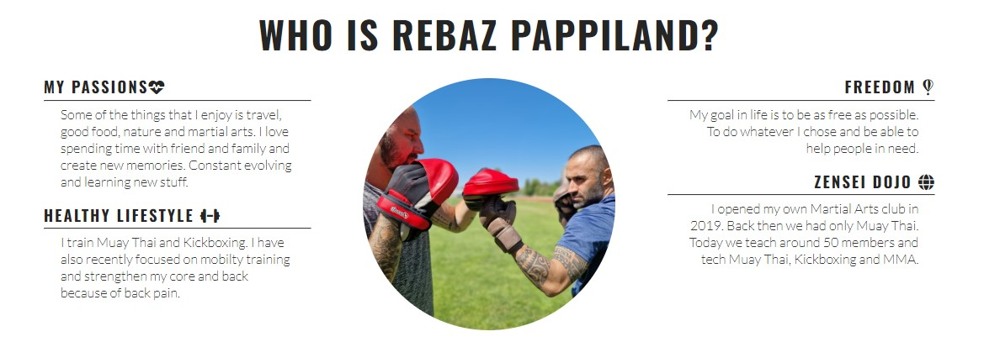
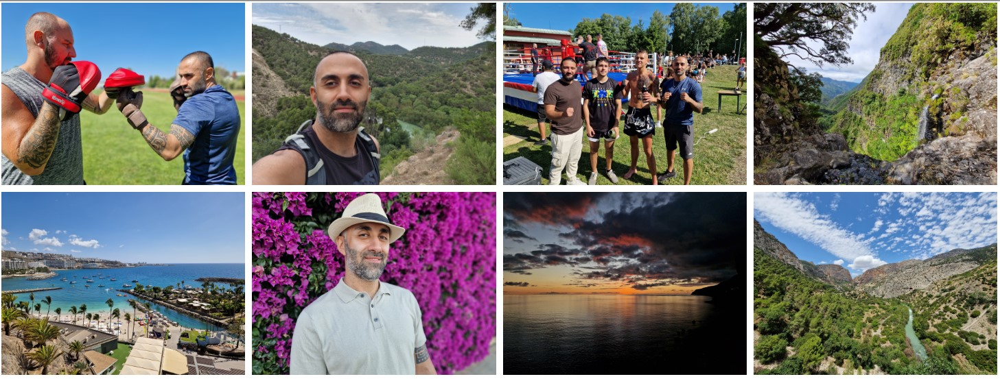
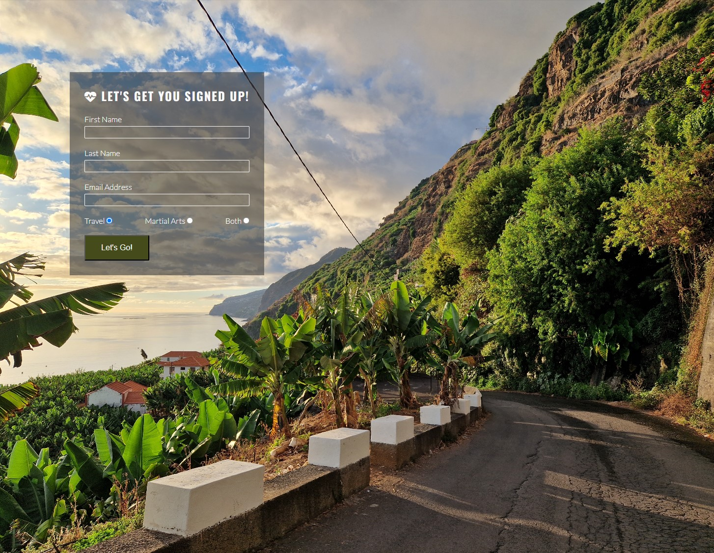

# Rebaz Pappiland

This site is a place for Rebaz Pappiland to share memories and events of his life with those who are interested. The goal of this site is to make the readers interested in travel, nature, food and martial arts and hopefully make the them take that step out of their comfort zone. Life is beautiful and meant to explore and take part.

## Features 

The homepage describes who Rebaz Pappiland is. A gallery page with pictures from Rebaz most special memories witht the goal to make the readers create their own memories. It can be something just as easy as take a walk somewhere beautiful or try martial arts. A footer with external links 
to Rebaz Pappiland social media.

### Existing Features

- __Navigation Bar__

  - Featured on all three pages, the full responsive navigation bar includes links to the Logo, Home page, Gallery and Sign Up page and is identical in each page to allow for easy navigation.
  - This section will allow the user to easily navigate from page to page across all devices without having to revert back to the previous page via the ‘back’ button. 

- __The landing page image__

  - The landing includes a photograph of Rebaz Pappiland with text overlay to allow the user to see a short introduction who Rebaz Pappiland is. 
  - This section introduces the user to Rebaz Pappiland with an eye catching picture and text to grab their attention.

- __Reason/Who is Rebaz Pappiland section__

  - This section will allow the user to see a more in-depth introduction to who Rebaz Pappiland is. 
  - This section is for the user to read more about Rebaz and see if they are interested in my passions and the reasons to why the user would want to know more about me in the future. Hopefully encourage them to make changes in their own life and create special memories. 

- __The Footer__ 

  - The footer section includes links to the relevant social media sites for Rebaz Pappiland. The links will open to a new tab to allow easy navigation for the user. 
  - The footer is valuable to the user as it encourages them to keep connected via social media.

- __Gallery__

  - The gallery will provide the user with images to see some of Rebaz special memories. 
  - This section is valuable to the user as they will see photographs of beautiful places Rebaz have visited. Hopefully make the user eager to visit similar places and try martial arts.

- __The Sign Up Page__

  - This page will allow the user to get signed up to Rebaz Pappiland newsletter. The user will be able specify if they would like to take part in travel, martial arts or both. The user will be asked to submit their full name and email address. 

### Features Left to Implement

- Some features I would like to implement is a short text attached to each photo that tells something about that special moment.
- When the user sign up, they will get a email everytime i post something new on my site or my social media sites.
- After the user have sign up a site would appear that shows the most recents photos/videos from Rebaz Pappiland social media accounts.

## Testing 

During the project I haven't encounter many buggs. Since I used much of the code from another project (Love Running) it was quiet easy to write and adapt the code so that it fits my project.
The header work as intended and is adaptive to different screen size and is always shown at the top no matter which page the user is on for easy navigation. The same goes for the other pages. 
The pictures I have used are taken by me and doesn't break any copyright rules. The gallery page is responsive and clear and contains enough pictures to make the user interested.

One bugg that i encounter was creating space between pictures on the gallery page. The preview in Codeanywhere showed correct layout but not the browser. I fixed this by updating the project to Github and refreshed the browser.
Another bug that I got was when changing between get and post in the signup link. The page didnt direct me to the sucess page as intended. After some git push and refresh it finally worked.
I have noticed that Codeanywhere can be slow sometimes.

### Validator Testing 

- HTML
  - No errors were returned when passing through the official [W3C validator](https://validator.w3.org/nu/?doc=https%3A%2F%2Fcode-institute-org.github.io%2Flove-running-2.0%2Findex.html)
- CSS
  - No errors were found when passing through the official [(Jigsaw) validator](https://jigsaw.w3.org/css-validator/validator?uri=https%3A%2F%2Fvalidator.w3.org%2Fnu%2F%3Fdoc%3Dhttps%253A%252F%252Fcode-institute-org.github.io%252Flove-running-2.0%252Findex.html&profile=css3svg&usermedium=all&warning=1&vextwarning=&lang=en#css)
- Accessibility
  - I confirmed that the colors and fonts chosen are easy to read and acceessible by running it through lighthouse in devtools.

### Unfixed Bugs

- There is no unfixed bugs.

## Deployment

- The site was deployed to GitHub pages. The steps to deploy are as follows: 
  - In the GitHub repository, navigate to the Settings tab 
  - From the source section drop-down menu, select the Master Branch
  - Once the master branch has been selected, the page will be automatically refreshed with a detailed ribbon display to indicate the successful deployment. 

The live link can be found here - https://rebazp.github.io/Project1/

## Credits 

Much of the code that I have used during this project is from a youtube channel called [Supersimpledev](https://www.youtube.com/watch?v=G3e-cpL7ofc).
I have also used some of the code from the project [Love Running](https://learn.codeinstitute.net/courses/course-v1:CodeInstitute+LRFX101+2023_Q2/courseware/e805068059af42af87681032aa64053f/1da6ad13213740f1855a51d30a2375b1/).

### Content 

- The design and, icons and fonts was taken from the project [Love Running](https://learn.codeinstitute.net/courses/course-v1:CodeInstitute+LRFX101+2023_Q2/courseware/e805068059af42af87681032aa64053f/1da6ad13213740f1855a51d30a2375b1/)
- Instructions on how to implement the code to my project was taken from [Supersimpledev] and [Love Running].
- The icons in the footer were taken from [Font Awesome](https://fontawesome.com/)

### Media

- The photos used on the home, gallery and sign up page are my own.